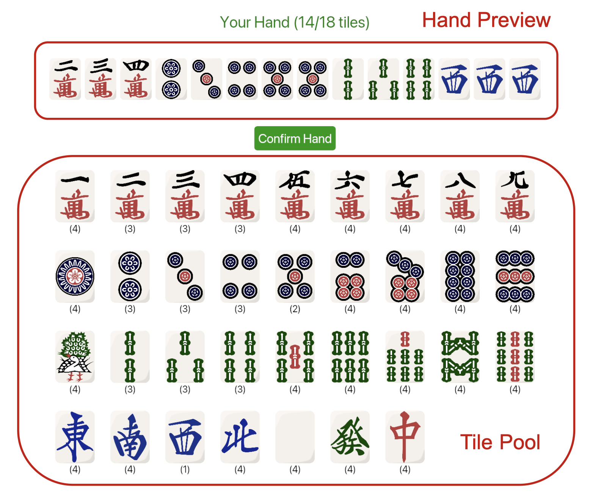

# Riichi Mahjong Scoring Calculator
Created by Thomas (@akakrabz), Karan (@Karan-Annam), Renyu (@Renyu-Liu)
## Introduction
Riichi Mahjong has a complicated mechanism of scoring calculation. People often find it hard to calculate points manually. That's why we have introduced Riichi Mahjong Scoring Calculator. This is a Rust library that calculates the score of a winning Riichi Mahjong hand. It receives a complete input of the winning hand and game state and returns a detailed score breakdown, guiding players to redistribute their points.
## Installation
### Step 1: Install Rust (skip if already done)

Visit official Rust website [Rustup](https://rustup.rs) to download Rust. Follow instructions on the website to configure Rust locally. Run `rustc --version` in the terminal to check if Rust is installed successfully.

### Step 2: Download the program

Option 1: Download and extract the ZIP file from [GitHub repo](https://github.com/Renyu-Liu/Riichi_Mahjong_Scoring_Calculator)

Option 2: Clone the repository from [GitHub repo](https://github.com/Renyu-Liu/Riichi_Mahjong_Scoring_Calculator):

    git clone https://github.com/Renyu-Liu/Riichi_Mahjong_Scoring_Calculator.git

Note: Make sure the the folder directly contains `Cargo.toml` file (.../Riichi_Mahjong_Scoring_Calculator/Cargo.toml). Do not move `Cargo.toml` to other folders.

### Step 3: Run the program

1: Change to the program folder:
    
    cd .../Riichi_Mahjong_Scoring_Calculator

Note: If you renamed "Riichi_Mahjong_Scoring_Calculator", `cd` goes with your renamed folder name

2: Run the program:

    Cargo run

## User Manual

### 1: Selecting Tiles

Click the tile in Tile Pool to add the tile into Hand Preview. Click the tile in Hand Preview to remove the tile.

You have to select at least 14 tiles to continue to next phase. Click "Confirm Hand" to continue.

### 2: Selecting Winning Tile

Click "Modify Hand" to return to tile selecting phase.

Click "Select" button under Winning Tile to select from your hand. You must select one winning tile to continue to next phase.

### 3: Selecting Game States

You may select pon/chii/kan from your hand as long as they are available. You may also check winds, state-dependent yaku, dora, and honba.

Selecting correct game states yields accurate score breakdown. 

Scroll down and click "Calculate Score" button to view the final score breakdown.

### 4: Generating Score Breakdown

The score breakdown includes the total points, fu/han points, and yaku detected. It also guides players to redistribute their points.

## Technical Overview

todo

## Challenges

We face challenges in improving loading speed. We found that the loading time for the tile pool is too long, which is restricted by the image loading speed. We are working on it.

## Reference

Scoring calculation is based on [standard Riichi Mahjong scoring rules](https://riichi.wiki/Japanese_mahjong_scoring_rules).

Yaku check is based on [standard Riichi Mahjong yaku lists](https://riichi.wiki/List_of_yaku).

Images of tiles are from [riichi-mahjong-tiles](https://github.com/FluffyStuff/riichi-mahjong-tiles).